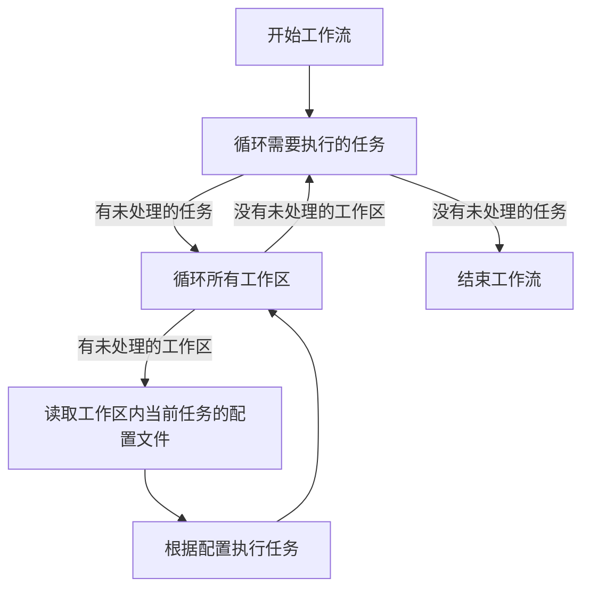

# 模块设计文档: 工作流管理

工作流调度小工具。通过项目配置，触发指定的任务，用于简化较为复杂的工程内初始化或者编译等流程

[](https://www.npmjs.com/package/@itharbors/workflow)
[](https://github.com/itharbors/workflow/actions/workflows/ci.yaml)

Workflow 将项目工作流分成了 workspace（工作区）和 task（任务）两个概念

每个工作区相当于一个需要处理的工程目录。而任务则是实际执行的动作。Workflow 会在执行每个任务的时候，循环所有工作区，在所有工作区内拿到对应的配置信息，根据这些配置信息去执行对应的任务

## 需求分析

### 功能需求

- 自定义任务
- 每个工作区执行不同的任务

### 非功能需求

- 无

## 整体架构设计

### 图例

开始工作流的时候先循环需要执行的任务列表，在执行每个任务的时候，再去循环每一个工作区。根据工作区内的配置文件区执行对应的任务



## 代码范例

### 基础用法

先初始化工作流的一些基本配置，然后开始执行

```ts
import { join } from 'path';
import { initWorkflow, executeTask } from '@itharbors/workflow';

// 初始化工作流
initWorkflow({
    entry: '.build.config.js',
    params: argv,
    cache: join(__dirname, '../../.temp/.cache-build.json'),
    cacheDir: join(__dirname, '../../.temp'),
    workspaces: [
        join(__dirname, '..'),
    ],
});

// 执行工作流任务，internal 开头的为内置的一些任务
const results = executeTask([
    'remove',
    'npm',
    'tsc',
]);

// 错误处理，发现任务失败，则异常退出进程
for (const taskName in results) {
    const taskResultList = results[taskName];
    for (const taskResult of taskResultList) {
        if (taskResult.state === 'error') {
            process.exit(-1);
        }
    }
}
```

### 注册自定义任务

```ts
import { registerTask, Task, TaskState } from '@itharbors/workflow';

class TestTask extends Task {
    getName() {
        return 'test';
    }
    getTitle() {
        return '测试任务';
    }
    execute(config) {
        // 这个 config 是 workspace 文件夹里，对应配置文件里，exports.test = function() {} return 出来的数据
        // 任务里约定好后，配置文件里负责组织数据
        return TaskState.success;
    }
}
registerTask(TestTask);
```

## 决策点

- [~~关键决策~~]
    - [~~影响设计方向的重要决策及其理由~~]
- ...

## 异常处理设计

- 执行任务的时候某个工作区执行失败
    - 描述
        - 一个工作流可能设置了多个工作区，当执行这个工作流中的某个任务的时候，其中一个工作区执行失败
    - 处理
        - 其他工作区还是会继续执行，收集所有的信息并在任务执行结束的时候汇总

- 某个任务执行失败
    - 描述
        - 某个工作区执行任务失败后，这个任务则识别为失败
    - 处理
        - 继续后续任务的执行，但会在任务执行结束的时候汇总

## 性能优化

- 在注册任务的时候提供并行配制，允许部分并行

## 附件与参考文档

- 无
